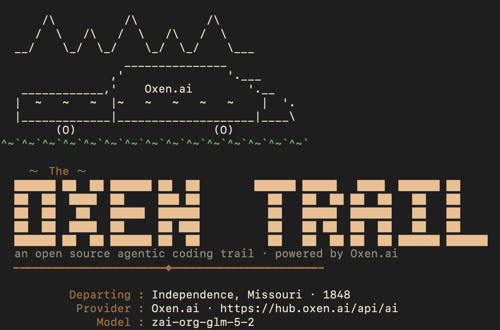

# oxen-harness 🐂

[](https://github.com/gschoeni/oxen-harness/actions/workflows/ci.yml)
[](LICENSE)

An open source, hackable agentic coding harness — like Claude Code or Codex, built in Rust and powered by [Oxen.ai](https://oxen.ai).

<p align="center">
  
</p>

## Get started

All you need is [Rust](https://www.rust-lang.org/tools/install) and an [Oxen.ai](https://oxen.ai) API key (an existing [`oxen` CLI](https://docs.oxen.ai/getting-started/cli) login is picked up automatically):

```bash
git clone https://github.com/gschoeni/oxen-harness && cd oxen-harness
export OXEN_API_KEY=sk-...        # or log in once with the `oxen` CLI
cargo run -p harness-cli
```

That's it — you're on the trail. Type what you want done and the agent edits
code, runs commands, and drives git, right from your terminal.

**No API key handy?** Run an open-weight model fully offline instead
(see [Running models locally](#running-models-locally-llamacpp)):

```bash
cargo run -p harness-cli -- --local qwen3-0.6b
```

`oxen-harness` runs an objective-check-driven agent loop against any model exposed through the Oxen.ai OpenAI-compatible chat completions API, with first-class tool calling for editing code, running commands, and driving git. Every turn is persisted so you can later export your sessions and fine-tune a model on your own coding traces.

## Why

- **Hackable & open source (Apache-2.0).** A small, readable Rust workspace you can fork and extend.
- **Extend it at three levels, no forking required.** Teach the agent reusable workflows with [skills](#extending-the-agent) (a markdown file — no code), connect your own HTTP endpoints as [custom tools](#extending-the-agent) from the desktop app's Settings, or add a built-in tool in Rust ([`AGENTS.md`](AGENTS.md#adding-a-built-in-tool) has a start-to-finish recipe).
- **Bring your own model.** Anything with a chat completions endpoint and tool calling — default is `claude-opus-4-8` via Oxen.ai, or run Qwen3 **locally** with llama.cpp (`--local`).
- **Your data, exportable.** Full conversation + tool-call history in SQLite, with a JSONL exporter for fine-tuning.
- **Two front ends.** A `claude`-style interactive CLI and a cross-platform [Tauri v2](https://v2.tauri.app/) desktop app.

## Architecture

For the layering, the lifecycle of a turn, and how to extend the harness, see
[`ARCHITECTURE.md`](ARCHITECTURE.md). At a glance, it's a single Cargo workspace
of focused crates:

| Crate | Responsibility |
|-------|----------------|
| `harness-core` | Shared domain types (messages, roles) and defaults |
| `harness-config` | Shared config plumbing: `~/.oxen-harness` paths, versioned JSON files, secrets in `.env` |
| `harness-llm` | Oxen.ai chat completions client: tool calling + SSE streaming, lightweight auth |
| `harness-tools` | The `TypedTool` trait + built-in tools: read/write/edit files, glob find, regex search, sandboxed shell, git, web search, interactive questions, canvas documents, plans, skills, and user-defined HTTP tools |
| `harness-compress` | Reversible context compression for stale tool output before it goes on the wire |
| `harness-store` | SQLite history (verbatim) + JSONL export for fine-tuning |
| `harness-local` | Local models: curated Qwen3 GGUF catalog, downloads + disk tracking, `llama-server` launcher |
| `harness-theme` | Configurable, shareable themes (palette + voice + style): built-ins, TOML/JSON load/save, partial overrides |
| `harness-oxen` | Version control for config, project data, and shareable traces, via the `oxen` CLI |
| `harness-agent` | The agent loop, wiring the LLM, tools, and store together |
| `harness-loop` | Goal-driven, self-verifying loops: gates, journal, stop conditions |
| `harness-runtime` | Front-end-agnostic runtime services shared by the CLI and desktop app |
| `harness-cli` | The `oxen-harness` interactive REPL binary |

A cross-platform [Tauri v2](https://v2.tauri.app/) desktop app lives in [`app/`](app/) (a separate project, excluded from this workspace) and reuses `harness-agent`. It needs the Tauri CLI, which is **not** bundled with cargo — install it once, then run from `app/`:

```bash
cargo install tauri-cli --version "^2" --locked   # provides `cargo tauri`
cd app
OXEN_API_KEY=sk-... cargo tauri dev
```

See [`app/README.md`](app/README.md) for the npm-based alternative (`npm install && npm run dev`) and platform webview prerequisites.

## Configuration

| Setting | Source | Default |
|---------|--------|---------|
| API key | `OXEN_API_KEY` env, or `~/.config/oxen/auth_config.toml` (`$OXEN_CONFIG_DIR` to override) | — (required) |
| Base URL | `--base-url` flag, `OXEN_BASE_URL` env, or `--host`/`OXEN_HOST` (expanded) | `https://hub.oxen.ai/api/ai` |
| Model | `--model` flag | `claude-opus-4-8` |
| Resume | `--resume <SESSION_ID>` flag (id printed on the death screen) | new session |
| Web search | `BRAVE_API_KEY` env (or `BRAVE_SEARCH_API_KEY`), or `~/.oxen-harness/.env` | always offered; key enables results |
| Local model | `--local <MODEL_ID>` flag (runs llama.cpp instead of a remote endpoint) | remote Oxen.ai |
| Theme | `/theme` in the REPL or `oxen-harness theme use <name>` (persists to `~/.oxen-harness/config.toml`) | Oregon Trail |

### Pointing at a different Oxen host

To use a local or self-hosted Oxen server, override the base URL — by host or full URL:

```bash
# Convenience: just the host[:port] (http is used for local hosts, /api/ai appended)
oxen-harness --host localhost:3001

# Explicit full base URL (any scheme/path)
oxen-harness --base-url http://localhost:3001/api/ai
```

Precedence: `--base-url` > `--host` > `OXEN_BASE_URL` > `OXEN_HOST` > default. The
API key is looked up by the resolved host (e.g. `localhost:3001`), so `OXEN_API_KEY`
or an `oxen` CLI login for that host works automatically. The desktop app honors
the same env vars.

### Web search (Brave)

The `web_search` tool uses the [Brave Search API](https://brave.com/search/api/)
and is always available. Set `BRAVE_API_KEY` (or `BRAVE_SEARCH_API_KEY`) in the
environment or `~/.oxen-harness/.env` — or just paste a key when prompted after
a failed search; both front ends turn the missing-key error into an inline
prompt so you can enable it mid-conversation and retry.

### Clarifying questions

When a decision is genuinely ambiguous, the agent can interview you with the
`ask_user_question` tool instead of guessing — 1–4 questions, each with 2–4
options, mirroring Claude Code's `AskUserQuestion`. The CLI renders an
interactive picker (with a row for typing your own answer), the desktop app a
question card. Piped/non-interactive sessions skip the prompt and the agent
proceeds with sensible defaults.

## Running models locally (llama.cpp)

Instead of a remote endpoint, `oxen-harness` can run open-weight models on your
own machine via [llama.cpp](https://github.com/ggml-org/llama.cpp)'s
`llama-server`, which speaks the same OpenAI-compatible API — so the agent (and
all its tools) work identically, fully offline, with no API key.

**1. Install `llama-server`** (one time):

```bash
brew install llama.cpp                       # macOS
# Linux/Windows: a release from https://github.com/ggml-org/llama.cpp/releases
# Or point at any build: export LLAMA_SERVER=/path/to/llama-server
```

**2. Browse and download a model.** The curated catalog is the Qwen3 family at
`Q4_K_M`, from a 0.6B that runs anywhere up to the 32B and the 30B-A3B
mixture-of-experts:

```bash
oxen-harness models list            # table of models, sizes, what's downloaded + disk used
oxen-harness models pull qwen3-8b   # download with a live progress bar
oxen-harness models remove qwen3-8b # reclaim the disk
```

**3. Ride it.** `--local` starts `llama-server` for the session (auto-downloading
the model first if needed) and points the agent at it:

```bash
oxen-harness --local qwen3-8b
```

Weights live in `~/.oxen-harness/models/`. Match the model to your hardware
(roughly: 0.6B–4B on a CPU/small GPU, 8B–14B on an 8–12 GB machine, 32B or
30B-A3B on a 24 GB card). The desktop app exposes the same catalog under
**🐂 Local models**.

## Theming — make it yours

The whole personality of the harness is a **theme**: a *palette* (named semantic
colors), a *voice* (the prompt, spinner phrases, per-tool verbs, banner art), and
a *style* (the desktop app's typography and framing). Both front ends render from
the active theme. Five ship built in — **Oregon Trail** (default, 8-bit pixel),
**Synthwave**, **Midnight**, **New York Times**, and **Cupertino** — and they
look genuinely different, not just recolored.

Themes are a single self-contained TOML file (also readable as JSON), so they're
trivial to export, import, and share. Files can be *partial* — override just a
few colors or phrases and the rest inherits the default. They live in
`~/.oxen-harness/themes/`.

```bash
oxen-harness theme list
oxen-harness theme use Synthwave
oxen-harness theme export Synthwave ./synthwave.toml   # share this file
oxen-harness theme import ./a-friends-theme.toml
```

Inside the REPL, `/theme` opens an interactive picker. To **vibe-code** a
brand-new theme, run `/theme new` (optionally with a description): a short
interview asks for the mood, color inspiration, and voice, then the model
designs a complete theme, saves it, and activates it live. The desktop app has
the same controls under **🎨 Theme**.

## On the trail (the CLI experience)

The REPL borrows its structure from modern coding CLIs (a welcome panel, an
in-place status spinner, transparent tool lines) and its *voice* from the 1980s
**Oregon Trail** game — because oxen pull the wagons on the trail, and Oxen.ai
powers this one. While the model thinks or a tool runs, you'll see trail-flavored
status lines animate in place ("Fording the river…", "Yoking the oxen…"), tools
show what they're doing, and errors are reported as the classic "You have died
of dysentery."

```
🐂 trail ❯ add a test for the parser
✶  Caulking the wagon to float across…  (3s)
  ◆ Reading the trail guide  read_file(src/parser.rs)
  └─ 142 lines forded.
```

The menu mirrors the game's title screen (`/help`):

```
You may:
  1. Travel the trail        — just type what you want done
  2. Learn about the trail   — /help
  3. See the Oregon Top Ten  — /export [path]  (save the journey as JSONL)
  4. Trade your oxen         — /model [name]
  5. Change your colors      — /theme  (select, create, import, export)
  6. Pack the wagon          — /queue add <msg> … then /queue run
  7. Set the wagon rolling   — /loop run [name]  (work until the gate is green)
  8. Inspect the wagon       — /code-review [branch]  (find → verify → report)
  9. Make camp / End         — /exit  (or Ctrl-D)
```

### Queuing messages

While the agent is thinking, streaming, or running tools, the composer stays
live — keep typing and press Enter to **stack** messages (the prompt shows the
depth: `[2 queued] ❯`), and they drain automatically, in order, as each turn
finishes. Stacked messages render as a navigable list above the composer:
**↑** steps into it, **Enter**/**e** edits a message inline, and **d** removes
it. The desktop app has the same live queue above its composer.

Piped / non-interactive sessions fall back to explicit commands: `/queue add
<msg>`, `/queue` to list, `/queue edit|up|down|rm <n>`, and `/queue run`.

### Loops (goal → verify → iterate)

A prompt hands the agent an instruction. A **loop** hands it a *job*, a way to
know when the job is done, and a rule for when to give up. Each pass runs
`DISCOVER → QUESTION → PLAN → EXECUTE → VERIFY → ITERATE`, with a journal fed
into the next pass (and saved for resuming) and hard stop conditions (an
iteration cap plus an optional token budget).

The heart of a loop is **VERIFY** — a gate that can actually *fail* the work,
so the agent makes real progress instead of agreeing with itself on repeat:

- **Command** — a shell command in the workspace; **exit 0 = pass**. The
  strongest, most objective gate (e.g. `cargo test`).
- **Rubric** — a separate, strict checker scores the work 1–10 against your
  criteria and passes only if every score clears a threshold — for when "done"
  can't be reduced to an exit code.

```bash
oxen-harness loop run default       # keep working until fmt + clippy + tests are green
oxen-harness loop run --goal "make every test in crates/parser pass" --max-iterations 6
oxen-harness loop new               # short interview → saved TOML you can share
```

The same commands work inside the REPL as `/loop …`. Loops live as shareable
TOML under `~/.oxen-harness/loops/`; `default`, `green-tests`, and
`clean-clippy` ship built in.

### Code review (find → verify → report)

`/code-review` runs a **configurable multi-step review pipeline** over your
changes — the working diff by default, or PR-style against a base branch:

```
🐂 trail ❯ /code-review            # staged + unstaged + untracked
🐂 trail ❯ /code-review main       # everything vs. the merge base with main
🐂 trail ❯ /code-review steps      # show the configured pipeline
```

The default pipeline borrows the shape the strongest production reviewers
(Claude Code, Codex) converged on, with each step running on a **fresh,
isolated agent** so nothing anchors the next step:

1. **find** — a recall-biased pass over the diff *and* the surrounding code
   (enclosing functions, callers, removed invariants), told explicitly not to
   self-censor: every candidate with a nameable failure scenario goes through.
2. **verify** — an adversarial pass that tries to *refute* each candidate
   against the actual source, returning CONFIRMED / PLAUSIBLE / REFUTED with
   quoted evidence. Only CONFIRMED and PLAUSIBLE survive.
3. **report** — dedups, ranks most-severe first (P0–P3), caps the list, and
   emits structured findings: `file:line`, a one-line title, and the concrete
   failure scenario.

The findings then land **in the conversation** as a settled exchange, so the
natural next message — `fix 1 and 3` — hands them straight to the agent to
repair. Every step's prompt is editable: the pipeline lives in
`~/.oxen-harness/code-review.json` (add, remove, reorder, or rewrite steps),
with a full editor in the desktop app under **Settings → Code review**. The
desktop composer has the same pipeline behind its **Review** button.

### Resuming an expedition

Every session is saved to `~/.oxen-harness/history.sqlite`. When you quit, the
tombstone screen engraves your session id and the command to pick the trail
back up:

```
  Your trail journal was saved. Resume this expedition with:
    oxen-harness --resume 8f3c…
```

Resuming restores the full transcript (so the model keeps its memory) along with
that session's working directory and model; override either with `--workspace`
or `--model`.

## Extending the agent

Two concepts cover everything the agent can be taught:

- **Tools are what the agent can *do*** — read a file, run a command, search
  the web, call your API. Every tool's name, description, and schema are sent
  to the model on every request.
- **Skills are what the agent *knows how to do*** — a workflow, a house style,
  a procedure, written as markdown. The model sees only each skill's name and
  one-line description, and pulls the full instructions into the conversation
  on demand via the built-in `skill` tool.

| You want the agent to… | Add a… | How |
|---|---|---|
| Follow your release-notes format, review checklist, deploy runbook | **Skill** (markdown, no code) | Settings → Skills, or drop a `SKILL.md` folder |
| Call your internal API or webhook | **Custom tool** (no code) | Settings → Tools → New tool (HTTP POST) |
| Do something new on the machine (parse a format, drive a CLI…) | **Built-in tool** (Rust) | The recipe in [`AGENTS.md`](AGENTS.md#adding-a-built-in-tool) |

A skill is a folder holding a `SKILL.md` (the same shape as Claude Code skills):

```markdown
---
name: release-notes
description: Writes release notes from the git log in our house style.
---

1. Run `git log --oneline` since the last tag.
2. Group changes into Added / Fixed / Changed.
3. One crisp line per change — no commit hashes, no filler.
```

Add one from the desktop app (**Settings → Skills → New skill**), drop a folder
in `~/.oxen-harness/skills/<name>/` for a global skill, or commit one to a repo
at `.oxen-harness/skills/<name>/` so everyone who opens that project gets it.
The description is the trigger — write it like "does X, use when Y" — and tools
are referenced by their backticked names ("read it with `read_file`"), which
the desktop editor autocompletes and lints. This repo ships
[`add-a-tool`](.oxen-harness/skills/add-a-tool/SKILL.md), a skill that teaches
the agent to extend itself with new tools.

## Contributing

This is a small, layered Rust workspace — you can hold the whole thing in your
head in an afternoon. [`CONTRIBUTING.md`](CONTRIBUTING.md) is the front door;
from there, [`ARCHITECTURE.md`](ARCHITECTURE.md) covers the layering and the
lifecycle of a turn, [`AGENTS.md`](AGENTS.md) is the contributor protocol — the
verification loop, project conventions, a codebase reading order, and the
add-a-built-in-tool recipe — and [`DOCUMENT-MAP.md`](DOCUMENT-MAP.md) indexes
every file.

## License

[Apache-2.0](LICENSE).

---

<p align="center">Powered by <a href="https://oxen.ai">Oxen.ai</a> 🐂</p>
