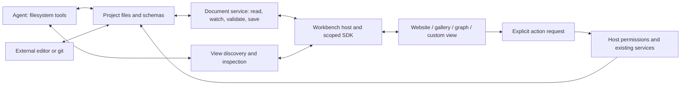

# Pluggable workbench views

**Date:** 2026-09-18

**Status:** Proposed implementation plan; no application behavior changed.

The right-hand panel becomes a workbench for user-selected views over project
files. A user can edit a website, browse generated images, or manipulate a node
graph there. The agent reads and edits the same files, and each view updates to
reflect those changes. Open-source contributors can add a view through one
registration point; users can eventually install a packaged view without
rebuilding the desktop app.

**User-confirmed direction:** support both bundled and installable views,
starting with bundled views. The existing tabs above the agent are the only
work-context tabs: each controls its agent conversation AND its current
right-hand view/app/context. There is no independent right-panel tab strip,
including nested Editor or Canvas document tabs.

Working assumption: treat “ComfyUI-style” as a node-graph interaction model.
Exact ComfyUI file/execution compatibility is a separate adapter decision.
The technical contracts below are proposed; the packaging priority and unified
tab model are confirmed product requirements.

```text
Filesystem | [ Website ] [ Images ] [ Product workflow ]  +
           |-----------------------------------------------
           | Agent for the selected tab | That tab's view
           |                           | Preview / gallery /
           |                           | graph / custom app
```

The existing tab strip owns both columns even if its exact placement remains
above the agent. A view picker, breadcrumb, or back/forward control can change
the current tab's right-hand context without introducing another tab system.

## 1. What we already have

| Existing seam | Keep and extend | Gap to close |
| --- | --- | --- |
| [`docks.tsx`](../app/src/features/docks/docks.tsx), [`DockColumn.tsx`](../app/src/features/docks/DockColumn.tsx) | Registry, shared columns, resizing, collapse, keyboard shortcuts | Static React imports, one entry per feature, hook-based availability; no external package or instance contract |
| [`ChatTabs.tsx`](../app/src/features/tabs/ChatTabs.tsx) | The single project-scoped top tab strip, session identity, ordering, shortcuts and history | Make the conversation and right-hand context one selection/restore operation; remove right-dock and nested document tab strips |
| [`store.ts`](../app/src/lib/store.ts) | Session/workspace routing and established behaviors | `RightTabId` is a fixed union; canvas, preview, editor, and gallery have separate state and focus rules |
| [`renderers.tsx`](../app/src/features/files/renderers.tsx), [`EditorPane.tsx`](../app/src/features/files/EditorPane.tsx) | File associations, raw/preview toggle, text/media/diff views | Specialized dispatch and nested tabs; no common document lifecycle or revision-aware UI save |
| [`watch.rs`](../app/src-tauri/src/commands/watch.rs), [`useFsChanged.ts`](../app/src/features/files/useFsChanged.ts) | Debounced changes from any process, bounded batches, bulk invalidation | Desktop-only plumbing; subscriptions and resynchronization need to become shared services |
| [`canvas.rs`](../crates/harness-tools/src/canvas.rs), [`HostCanvasSink`](../crates/harness-host/src/bridges.rs) | Stable document IDs, streaming previews, existing tool compatibility | Desktop emits content as events; durable content is recovered through chat history rather than ordinary project documents |
| [`viewer.rs`](../crates/harness-tools/src/viewer.rs) | `open_file` validates paths and delegates through a host interface | File opening cannot select a community view |
| [`harness-preview`](../crates/harness-preview/src/lib.rs), [`preview.rs`](../app/src-tauri/src/preview.rs) | Dev-server lifecycle, logs, console feedback, native browser surface | Native view bounds, visibility, screenshots, and resource cleanup require a host adapter |
| [`harness-media`](../crates/harness-media/src/library.rs), [`GalleryPanel`](../app/src/features/media/GalleryPanel.tsx) | Project outputs and append-only `generations/manifest.jsonl`, job lifecycle | Gallery is coupled to global UI state; expose its existing service through the view contract |
| [`uiState.ts`](../app/src/lib/uiState.ts) | File-backed personal preferences in `~/.oxen-harness/ui.json` | Add versioned workbench instance/layout restoration |

The existing dock registry is the starting point. Introduce adapters around the
working features and move their responsibilities incrementally. Preserve their
tool names, saved files, and capabilities while intentionally replacing their
independent tab navigation with the unified top-tab model.

Two implementation traps are already visible: dynamically adding entries to
the current `DOCKS.map(dock => dock.useAvailable())` would change hook order;
and keeping editor tabs mounted inside `EditorPane` does not preserve them when
the enclosing dock itself unmounts. The new host must address both explicitly.

## 2. Target architecture



Separate four responsibilities:

1. **Documents:** authoritative project content and assets, addressed by
   workspace-relative paths. Ordinary source files stay in their native format.
2. **View definitions:** a stable ID, supported resources, renderer entry,
   schemas, and requested capabilities. A definition describes a kind of view.
3. **Work contexts and view instances:** each existing top tab owns its agent
   session and one active right-hand instance. That instance identifies a
   resource, renderer, workspace, and local presentation state. Several top
   tabs can use the same graph definition with different files. Resource history
   and recoverable drafts are data, not another strip of tabs.
4. **Host services:** document access, subscriptions, layout, theme, agent
   context, and explicitly requested operations. Process and generation
   lifecycles belong to their existing backend services.

Keep this in focused modules initially: `app/src/features/workbench/`, a small
SDK package when the public interface stabilizes, `harness-runtime` document
and discovery modules, `harness-host` orchestration, and `harness-protocol`
DTOs/events. `harness-tools` owns model-facing arguments and host traits.
Keep domain code in `harness-media` and `harness-preview`; avoid a new general
workflow engine or crate until a concrete dependency boundary requires one.

### View contract

The first implementation should have a small typed contract:

- **Definition:** namespaced `id`, package/API version, title/icon, resource
  matching, renderer kind, and capability declarations.
- **Resource:** explicit kind plus relative path(s), or a host-issued service
  reference for a website preview or live job. Do not overload paths with new
  magic prefixes. Arbitrary websites cannot acquire document capabilities.
- **Lifecycle:** create, activate/deactivate, refresh, request-close, and dispose.
  The host owns dirty state and close decisions; views report readiness/errors.
- **Context:** scoped document handles, theme tokens, instance identity,
  visible bounds when needed, and a bounded optional selection/context summary.
- **Inspection:** source paths/revisions, validation diagnostics, pending edits,
  live status, and supported actions. Persisted facts and transient UI facts
  are explicitly distinguished.

Definitions are data. Hooks run inside mounted renderer components, never
inside a runtime-sized registry loop. A module can supply a simple file
renderer or a complete interactive view using the same host services.

## 3. Files are the shared interface

Example project/package layout (proposed names):

```text
my-project/
  src/                                  # website source stays where it is
  workflows/product-shoot.graph.json    # editable graph: nodes, edges, params
  generations/manifest.jsonl            # existing media history
  generations/...                      # existing images and videos
  .oxen-harness/
    workbench.json                      # optional shared view/workflow presets
    views.lock.json                     # exact package versions + content hashes
    views/acme.node-graph/              # optional project-local view package
      view.json
      dist/index.html
      dist/assets/...
      schemas/graph.schema.json
      README.md
      skills/edit-graph/SKILL.md         # optional, enabled through normal skills
    artifacts/<document-id>/            # new durable canvas content + metadata

~/.oxen-harness/views/<id>/<version>/  # user-installed packages
~/.oxen-harness/ui.json               # personal tabs/layout/view preferences
```

Project files and shared presets should survive cloning. Personal window
geometry, active tabs, graph viewport/selection, local trust grants, and machine
paths stay in user storage. Node positions and meaningful authoring choices
belong in the graph document; zoom and hover state do not. Never store API keys
in a manifest, workflow, or inspection result.

Do not force existing code, image binaries, media history, and custom documents
into one JSON wrapper. JSON documents that a module introduces get a documented
schema version, stable entity IDs, and deterministic serialization. Binary
outputs are referenced by path. Preserve unknown supported extension fields
when round-tripping; unsupported schema versions open read-only with an error.

### Synchronization and conflict semantics

1. A read returns content plus a revision derived from the file bytes.
2. A view subscribes to the resource or a bounded directory scope. Watcher
   events invalidate cached data; the next read reconciles from disk.
3. UI saves provide the expected revision. The backend validates, checks the
   current revision, and atomically replaces the file under a shared per-path
   lock. Route in-process agent and UI writes through the same coordination
layer; separate per-session locks are insufficient.
4. A stale revision produces a conflict with reload/compare/save-copy choices.
   Unsaved buffers are retained, and “Save” never silently overwrites a known
   newer revision. Undo applies against the current revision too.
5. An incomplete external write or invalid graph preserves the last valid
   render with a visible stale/error state. The agent can still read and fix
   the actual bytes; the UI must not present the previous render as current.
6. Subscribe/read races, duplicate events, renames, deletes, bulk changes, and
   watcher reconnects trigger reconciliation. Re-activation/reconnect performs
   a fresh revision check rather than assuming every event was delivered.

Hash checks and shared locks protect cooperative writers. An unrelated process
can still race a read/check/replace operation; atomic rename alone is not
cross-process compare-and-swap. Preserve recoverable previous bytes for these
saves and document the remaining limitation. Multi-file transactional editing
is outside the first contract; prefer one canonical structured document with
separately written assets.

Use one reference-counted watcher per workspace, with subscriptions filtered
by resource. Reuse the current debounce and bulk-change behavior. Package
development reloads need an explicit subscription because the existing watcher
ignores `dist/`. Cap reads/events, release subscriptions on dispose, and do not
rerender every view on every chat token or graph pointer movement.

Use the existing session ID as the top tab's identity initially. Store its
active view/resource and bounded context history alongside restoration data,
and key unsaved document buffers by workspace/resource with explicit ownership.
Switching top tabs derives both visible panels from the same active session;
late loads/events must carry their original session and instance IDs. Reopening
a conversation from history also restores its right-hand context. Changing the
view inside a tab does not create or reset the conversation. An explicit new
top-level tab uses the existing new-chat flow; it never silently forks a chat.

Canvas compatibility: keep `canvas` arguments and stable IDs. New completed
calls persist content and metadata under `.oxen-harness/artifacts/`, then emit a
resource update. Streaming content is a provisional overlay until the tool
completes. Historical transcript canvases remain readable; saving them creates
an artifact once without rewriting historical transcripts. Account for the
new filesystem mutation in permission/concurrency handling. The CLI and
desktop should ultimately use the same artifact persistence service.

## 4. Agent and user interaction

Use ordinary `read_file`/`edit_file`/`write_file` for durable content. Add a small
view interface for what file operations cannot express:

| Proposed operation | Purpose |
| --- | --- |
| `list_views` | Discover available definitions/open instances with resource types, state paths, schemas, and supported operations |
| `open_view` | Open a resource with a specified or resolved renderer; return an instance ID and actual display status |
| `inspect_view` | Read bounded source/revision/validation details, live status, and optionally current selection or unsaved-state indication |

Extend `open_file` to use the same resolver while keeping existing calls valid.
Use deterministic precedence: explicit user choice, saved file association,
specific resource match, then text/media fallback. Show “Open with…” when the
user wants another renderer. A disabled/missing package keeps its resource
recoverable through a raw view or a missing-view placeholder.

Expose actionable operations through their real host services/tools. A view
can request image generation, preview restart, or a typed graph run; it cannot
gain unrestricted tool execution merely by naming a tool in its manifest.
The host derives input schema and permissions from the registered operation,
applies workspace scope, plan-mode restrictions, approvals, budgets, cancellation,
and concurrency classification, and records the result. Any future generic
action dispatcher must enforce the underlying action's policy, not just its
wrapper name. Long jobs return IDs and progress from the backend.

Define three layers of plugin authority: requested capabilities in the package,
user-granted capabilities for that installed version/workspace, and the active
session's permissions. Effective access is their intersection. Interactive
edits remain scoped even when initiated directly by the user. Agent-triggered
actions obey the agent's gate. Document edits never automatically execute a
workflow, start a process, or spend money; execution is an explicit operation.

Add a compact available-view summary to agent context, with schemas and module
instructions loaded on demand. Module-provided instructions are project/tool
context, not privileged system instructions. Inspecting a view reports whether
its renderer is mounted, backgrounded, unavailable, or stale. Headless hosts
can inspect files and run supported backend actions; they must not claim that
a view was displayed or invent a selection from an absent renderer.

User experience:

- The existing top tabs are the only work-context tab strip. Selecting Website,
  Images, or Workflow switches both the conversation and its right-hand app.
  Tab ordering, close, shortcuts, status and history keep their existing roles.
- A view picker replaces the current tab's right-hand view. File opens and
  “Open with…” target that same context; back/forward or a recent-resource menu
  revisit prior resources. “Open in new tab” explicitly creates a new combined
  conversation/view context through the existing new-chat flow.
- Remove right-dock tabs and the Editor/Canvas document tab strips. Retain
  file selection, raw/preview mode switches, gallery back/next, and graph
  navigation as controls inside the active app. Modules may present their own
  content navigation, but the SDK examples introduce no second work-context
  tab strip. Composite modules can show related content together in one view.
- Project documents are shared across chats; focus and selection are local to
  the instance. A background agent marks its originating top tab without
  changing the current conversation/view or overwriting a dirty buffer. Explicit
  user opens focus; agent opens honor a “keep this view”/follow preference.
  Opening the same resource in the same context reuses its instance.
- A common frame supplies title, loading/error states, refresh, raw-file access,
  “Add selection to chat,” and theme/accessibility conventions where applicable.
- Hidden views suspend expensive rendering. Host-owned drafts survive renderer
  unmounts and can be recovered after a crash. Closing a view does not implicitly
  cancel a generation or dev server; stopping work is a separate explicit action.
  Closing a top tab retains the existing running-agent behavior and preserves
  its recoverable context; deleting conversation history is a distinct action.
- Restore the selected top tab and its view together. Missing modules or files
  leave the conversation usable with a recovery state on the right. Independent
  right-panel tabs and independently navigable host split panes are out of scope.

## 5. Extension packaging and isolation

Support two authoring paths with the same resource/SDK semantics:

**Bundled module:** a feature folder, definition, renderer, optional backend
adapter, and one registry entry. Trusted maintainers can compile React and Rust
extensions with the app. Built-in modules should consume the public SDK as they
are migrated; compatibility wrappers can temporarily use existing internals.

**Installable package:** a versioned manifest, prebuilt web assets, schemas,
documentation, and optional skill templates. It runs without compiling the
desktop app and has no import access to its Zustand store or arbitrary Tauri
commands. A framework-neutral SDK lets authors use React or another UI stack.
Installing a view does not run package-manager/install scripts.

Illustrative manifest, finalized only after the first reference modules work:

```json
{
  "id": "acme.node-graph",
  "version": "0.1.0",
  "apiVersion": 1,
  "title": "Node Graph",
  "entry": "dist/index.html",
  "resources": [{ "glob": "**/*.graph.json", "schema": "schemas/graph.schema.json" }],
  "capabilities": {
    "documents": { "read": "opened", "write": "opened" },
    "selection": true,
    "actions": ["oxen.media.generate_image"]
  }
}
```

`opened` denotes host-issued resource handles, not arbitrary paths supplied by
plugin JavaScript. Action IDs resolve to host-owned implementations. Adding a
new native operation requires a trusted backend adapter in the initial release;
installable UI packages are not arbitrary Rust/Python plugin runtimes.

Package lifecycle: install from a local folder/archive first, validate paths,
symlinks, size limits and manifest, inspect capabilities, enable per workspace,
disable/uninstall without deleting project data, and explicitly upgrade with
rollback. Record immutable versions/content hashes. A project lock selects an
exact version; otherwise use the user's explicit enabled version. Duplicate
unresolved IDs produce a diagnostic rather than silent shadowing. A repository
can recommend packages but cannot grant them trust simply by containing files.
Changes to package code/capabilities invalidate the applicable grant; trusted
development mode can use an explicit scoped reload workflow.

**Isolation is a release gate for installable code.** Build and test a minimal
cross-platform renderer host before selecting iframe versus dedicated webview
delivery. Tauri documents that Linux cannot distinguish an embedded iframe's
IPC requests from its enclosing window, and application commands need explicit
scoping. Therefore an iframe inside the privileged app cannot by itself be our
permission boundary. Use a separately constrained surface and an authenticated,
instance-scoped broker; select the exact transport through the spike. See
[Tauri capabilities](https://v2.tauri.app/security/capabilities/).

Audit command scoping, asset access, and content policy before package loading:
the current desktop configuration has `csp: null`, a broad asset scope, and a
simple build script. The new surface must be unable to invoke unrelated
commands or read unrelated assets even if it bypasses the SDK. Scope broker
requests to package version, resource grants, workspace, and instance; validate
messages, limits, timeouts, and revocation. Grant neither process execution nor
network access implicitly; check direct resource loads/navigation as well as
SDK calls. Credentials remain in host services.

For any iframe transport, isolate origins and authenticate the channel; avoid
same-origin script execution combined with sandbox escape permissions. Browser
sandboxing and Tauri IPC scoping are separate concerns. See
[MDN iframe sandbox semantics](https://developer.mozilla.org/en-US/docs/Web/HTML/Reference/Elements/iframe#sandbox).
Report renderer exceptions/timeouts without taking down the workbench; bound
surface counts and verify recovery from a hung renderer on supported platforms.

## 6. Reference use cases

| Module | Durable state | Agent interaction | Host-specific work |
| --- | --- | --- | --- |
| Website preview | Existing website source and preview settings | Edit source; start/restart existing preview service; read logs/console; supported screenshots | Native-surface bounds, visibility, navigation, disposal; screenshots advertise platform support |
| Image/video gallery | Existing output files and `manifest.jsonl` | Existing media tools create/cancel jobs; inspect output paths; optionally save selection/collection documents | Reuse `harness-media` queue, spend confirmation, library and events |
| Documents/canvas | Markdown, code, HTML/SVG and artifact metadata | Existing `canvas` compatibility plus ordinary file edits | Streaming overlay, existing sandboxed renderers, durable save |
| Node graph | Versioned `*.graph.json`, stable nodes/edges, parameters, authoring positions | Read/edit the graph; inspect selection/validation; explicitly run supported operations | Validate connections; delegate a small set of executable node types to existing host services |
| Community view | Its documented project files and schemas | Filesystem tools plus bounded view inspection and permitted actions | Public SDK only unless a separately trusted backend adapter is required |

The graph is the proof of extensibility. First ship a small editable graph with
prompt/input, image-generation, and output nodes; its bounded runner calls the
existing Oxen media service and writes output references. Invalid edges and
unsupported nodes are visible errors. Validate a run snapshot/revision before
starting, record run/node IDs and outputs, and keep cancellation/job completion
independent of tab visibility. A later graph edit does not mutate a running job.
Do not blindly replay paid jobs after a restart; reconcile existing job IDs.

Use the visual style of ComfyUI as inspiration initially. If exact compatibility
is desired, add an explicit import/export adapter with fixtures against
[ComfyUI's documented workflow schema](https://docs.comfy.org/specs/workflow_json).
File-format compatibility and execution-engine compatibility require separate
tests. Preserve unsupported nodes for inspection; never silently execute an
approximation. Provider-backed generation stays on the project's Oxen services.

## 7. Implementation sequence and acceptance gates

Each phase is a small set of coherent commits with tests before behavior where
practical, followed by the repository's dedicated review/refactor pass. Record
verification and accepted decisions as implementation progresses.

| Phase | Concrete deliverable | Acceptance gate |
| --- | --- | --- |
| **0. Baseline and context contract** | Characterize current dock behavior; define one top tab = agent session + current right-hand context | Regressions encode switching/restoring both panels together, background routing, and dirty-buffer survival; document the native-surface requirements |
| **1. Workbench host and unified navigation** | Generic definitions and instances, separate store slice, lifecycle, shared frame; wrap current right docks and remove secondary tab strips | New bundled view requires its module plus registration; no new `RightTabId` variant, `App.tsx` branch, or domain-specific central-store field; only the existing top tabs switch work contexts |
| **2. Document service** | Revisioned read/save, shared write coordination, reference-counted watch/reconcile, schema diagnostics, canvas persistence | Agent, UI, and external file edits update a view; stale UI saves are refused; malformed/deleted files and restarts retain recoverable data |
| **3. Agent contract and built-in migration** | List/open/inspect tools and protocol, `open_file` resolver, Preview/Gallery/Canvas/Editor adapters, headless semantics | Both a user and an agent can operate each existing surface through the common contract; native preview and media job behavior remain intact |
| **4. Bundled graph reference** | Editable graph module and small Oxen-backed runner exercise the same public contract as existing views | New user clones an example, opens a workflow context, edits visually and via agent, runs it explicitly, and sees persistent outputs; graph renderer needs no private app imports |
| **5. Installable views and SDK** | Cross-platform isolation spike, manifest validation/discovery, constrained renderer host, scoped broker, local package install/enable/update/rollback, development template | The graph renderer also works as an installed package without rebuilding the app; scope bypass, incompatible version, crash, and uninstall tests pass; native adapters remain separately trusted |
| **6. Presets and contributor finish** | Shareable workflow presets, per-context defaults/restore, authoring guide and example packages | Switching Website → Images → Workflow changes agent and right-hand context together; a contributor builds a new view from the guide without editing core routing or adding another tab strip |

Phases 1–3 are a useful internal milestone, but the pluggable-view feature is
not complete until the installable-package and graph proof gates pass. The
first source-extension proof should be a tiny JSON-backed board in phase 1;
carry it through SDK extraction to expose unnecessary coupling early.

Treat a workflow preset as data selecting an installed view, resources, settings,
and instructions. Do not make presets a second execution language. Start package
distribution with folders/archives; a marketplace, dependency solver, native
plugin ABI, unrestricted code nodes, arbitrary docking/window manager, and
collaborative CRDT editing can wait for demonstrated needs.

### Where the work lands

- `app/src/features/tabs/` remains the only work-context tab strip and drives
  paired agent/view selection. `features/docks/` retains column sizing/collapse
  while removing right-side tab navigation. `features/workbench/` owns definitions,
  instances, host frame, picker and render adapters.
- `app/src/lib/store.ts` delegates to a workbench slice; `uiState.ts` gains
  versioned restoration data and migration from existing right-panel choices.
- `harness-runtime` owns view discovery and document persistence/watch services;
  extract reusable file operations from the desktop bridge rather than copy them.
- `harness-tools` owns model-facing contracts; `harness-host` owns scoped
  operation dispatch and instance status; `harness-protocol` owns wire shapes.
  Tauri and HTTP adapters share validation and failure semantics.
- `harness-media` and `harness-preview` remain the operation providers.
- Add SDK/template/example files when phase 5 stabilizes the interface. Update
  `app/README.md`, `ARCHITECTURE.md`, `PROTOCOL.md`, `DOCUMENT-MAP.md`, status and
  accepted technical decisions alongside their implementation. The confirmed
  tab model and packaging priority are recorded now in `03-decisions.md`.

### Verification

Behavioral coverage must include a single top-level work-context tab strip;
atomic conversation/view switching and restoration; no right-dock or nested
Editor/Canvas tab strips; safe late events after a tab switch; registry changes
without hook-order errors;
renderer matching and missing-module fallback; dirty-buffer retention;
concurrent sessions editing one resource; stale saves and watcher recovery;
rename/delete/invalid-schema cases; transcript-canvas compatibility; focus
rules for background agents; job cancellation after view close; instance and
workspace scope isolation; package upgrade/revocation; and protocol parity.

Run actual native smoke tests for preview bounds, overlays, tab switches,
keyboard focus, renderer hangs, and package permissions on macOS, Windows,
and Linux. Browser-only tests do not establish native webview isolation.
Check keyboard/screen-reader navigation, light/dark themes, and narrow windows.
Measure the existing app against the changed app for typing responsiveness,
watcher storms, many inactive tabs, and a large graph; set explicit budgets
from the phase-0 baseline rather than inventing performance claims.

For implementation iterations run and read the repository's required checks:

```bash
cargo fmt --all -- --check
cargo clippy --workspace --all-targets -- -D warnings
cargo nextest run
(cd app/src-tauri && cargo clippy -- -D warnings)
(cd app && npx tsc --noEmit && npx vitest run)
scripts/gc-target.py
```

Record any baseline blockers separately; do not call a failing suite green.
After each feature commit, review for modularity, maintainability, readability,
idiomatic Rust/React and simplicity; apply worthwhile improvements, re-run the
checks, and commit the polish separately as required by `AGENTS.md`.

## 8. Planning validation

This proposal was checked against the current working-tree implementations,
including in-progress changes; its module names and paths above identify the
actual migration seams. External documentation was consulted for the Tauri
permission boundary, iframe isolation semantics, and ComfyUI's workflow schema.
No runtime implementation or runtime verification is claimed by this plan.

The planning review applied these concrete improvements:

1. Make the existing top tab the owner of both panels, removing the draft's
   separate view-tab and split-pane roadmap after the user's clarification.
2. Put the bundled graph proof before installable packages so real modules shape
   the SDK; leave custom native operations with explicitly trusted adapters.
3. Specify draft ownership and revision conflicts independently of renderer
   mount state, including the limitation of unrelated external writers.
4. Make native isolation an acceptance gate instead of assuming an iframe
   inherits a safe Tauri permission boundary.

Documentation validation: local source links resolved, the illustrative JSON
manifest parsed, and whitespace/code-fence checks passed. Runtime suites were
not run for this documentation-only proposal; their required implementation
commands and acceptance cases are listed above.

The user confirmed bundled-first packaging and the single top-tab model during
planning; both are reflected above. The first concrete implementation should be
characterization and the workbench host with unified navigation, followed
immediately by the shared document lifecycle. No further product clarification
is required to start that sequence.
